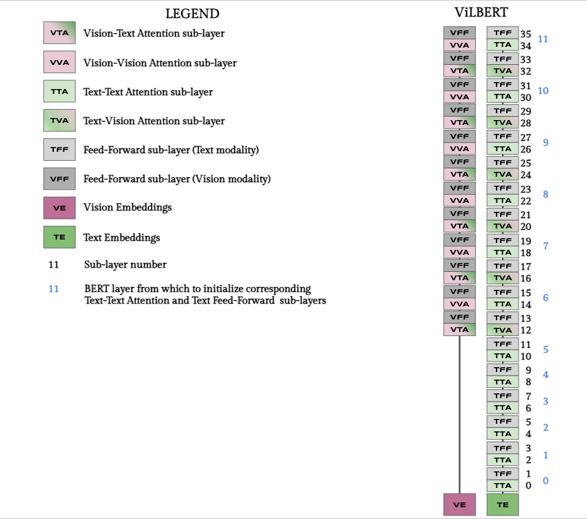

# Models

## Pretrained Models

We distribute models pretrained on Conceptual Captions.
We share ViLBERT, LXMERT and VL-BERT pretrained as originally presented in their papers,
as well as the weights for ViLBERT, LXMERT, VL-BERT, VisualBERT and UNITER pretrained in our controlled setup.
For the latter, we distribute the weights that lead to higher average downstream performance when fine-tuned once.

| Model             | VQAv2 | RefCOCO+ | NLVR2 | Flickr30k IR | Flickr30k TR |
|-------------------|-------|----------|-------|--------------|--------------|
| [ViLBERT](https://sid.erda.dk/share_redirect/AgwrMiOjTv)           | 66.68 | 70.49    | 74.26 | 58.90        | 75.50        |
| [LXMERT](https://sid.erda.dk/share_redirect/fYBrp01t8M)            | 67.98 |          | 71.58 |              |              |
| [VL-BERT](https://sid.erda.dk/share_redirect/cCMQ8SXHdf)           | 67.44 | 71.00    |       |              |              |
| [ViLBERT (CTRL)](https://sid.erda.dk/share_redirect/aQCx8cLWK7)    | 68.97 | 70.53    | 72.24 | 60.34        | 78.80        |
| [LXMERT (CTRL)](https://sid.erda.dk/share_redirect/aBnbvwrVAq)     | 67.52 | 70.49    | 71.09 | 58.62        | 74.90        |
| [VL-BERT (CTRL)](https://sid.erda.dk/share_redirect/Dr8geMQyRd)    | 68.23 | 71.23    | 73.22 | 57.62        | 70.90        |
| [VisualBERT (CTRL)](https://sid.erda.dk/share_redirect/GCBlzUuoJl) | 69.03 | 70.02    | 72.70 | 61.48        | 75.20        |
| [UNITER (CTRL)](https://sid.erda.dk/share_redirect/FeYIWpMSFg)     | 68.67 | 71.45    | 73.73 | 60.54        | 76.40        |

## Models Definition

Models are defined in configuration files (see [config/](config) for some examples).
Rather than using Transformer layers, we specify attention and feed-forward sub-layers for each modality, 
which allows to quickly extend proposed architectures.
In particular, the following sub-layers are defined:
- `tt_attn_sublayers`: text-text attention sub-layers
- `tv_attn_sublayers`: text-vision attention sub-layers (text used as query, vision as context)
- `vt_attn_sublayers`: vision-text attention sub-layers (vision used as query, text as context)
- `vv_attn_sublayers`: vision-vision attention sub-layers
- `t_ff_sublayers`: feed-forward sub-layers for the text modality
- `v_ff_sublayers`: feed-forward sub-layers for the vision modality

In addition, the following parameters allow to tune parameter sharing across modalities:
- `shared_sublayers`: sub-layers that share parameters between modalities 
- `single_ln_sublayers`: sub-layers in which text and vision tensors are concatenated and fed into a single LN layer

Finally, `bert_layer2attn_sublayer` and `bert_layer2ff_sublayer` are used to load text-only BERT layers into VOLTA ones. 

The following figure shows how these sub-layers are used to construct ViLBERT:
